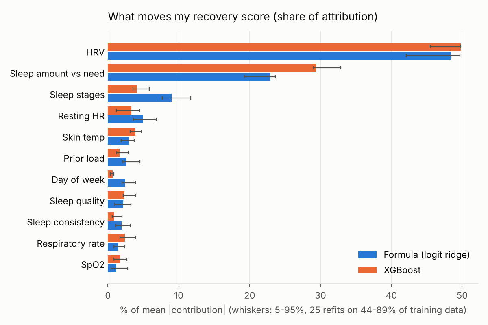

# whoop-reverse-recovery

WHOOP's coach tells you why your recovery moved and ranks the drivers, but it gives no numbers and
no way to check the ranking. This repo pulls your own data through the WHOOP API, approximates the
recovery score with a model, and attributes every score, and every day-over-day change, to its
inputs in recovery points.

Everything runs locally against **your own** WHOOP account. Nothing is hosted, and no data or tokens
leave your machine.

## Status

| Milestone | State |
|---|---|
| M0 data access, M1 features + baselines | done |
| M2 interpretability + formula reconstruction | done: see `results/m2_summary.txt` |
| M3 archetypes / anomalies / schedule irregularity | next |

Headline (one person, 411 cycles, held-out post-gap period): a logit-link linear "formula"
reaches MAE 6.6 / R² 0.82, and XGBoost reaches 5.7 / 0.89. HRV accounts for about half of the
attribution and sleep amount vs sleep need for about a quarter. The ranking is identical in all 25
stability refits. These describe the model's attribution; they are not causal effects.



## Setup (bring your own credentials)

1. Register an app at the WHOOP developer portal with redirect URI `http://localhost:8000/callback`.
2. `python -m venv venv && source venv/bin/activate && pip install -r requirements.txt`
3. Create `.env` with `WHOOP_CLIENT_ID=...` and `WHOOP_CLIENT_SECRET=...`.
4. `python src/auth.py`: log in, then copy the URL you are redirected to.
5. `python src/get_tokens.py`: paste that URL. Tokens go to `.whoop_tokens.json` (git-ignored)
   and are refreshed automatically from then on.

## Pipeline

```
python src/sync.py --full          # first pull of the full history (later: python src/sync.py)
python src/train_baselines.py      # time-series CV on the training period
python src/attribution.py          # grouped Shapley attribution (~20 min; --quick skips stability)
python src/m2_figures.py
python -m unittest discover tests  # offline tests for the sync code
```

`sync.py` re-pulls the last 7 days (WHOOP edits recent records), merges by record id, and writes
nothing unless all four endpoints succeed. A daily schedule for macOS is in
`scripts/com.whoop-reverse-recovery.sync.plist.template`.

Settings that may differ for your data live in the `CONFIG` dicts at the top of
`src/features.py` (test-period start, baseline window, exclusions) and `src/attribution.py`.

## Method notes

- One row per WHOOP cycle, local time. Personal baselines look backward only (30 days).
- Time-based hold-out with the thresholds pre-registered before evaluation (`preregistration*.json`).
- Attribution: exact Shapley values over 11 input groups against one fixed reference, so the
  contributions sum exactly to the prediction minus that reference, and day-over-day differences
  sum exactly to the change.
- Limits: one person; an approximation of a proprietary score; attribution is not causation.
